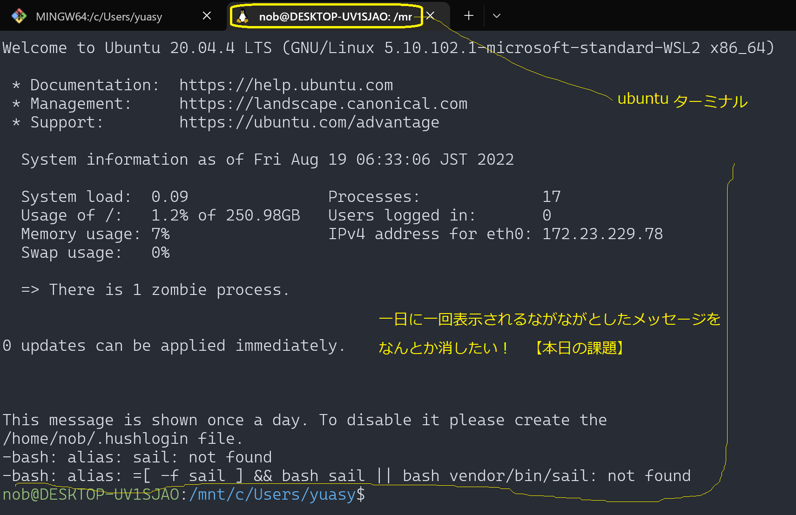
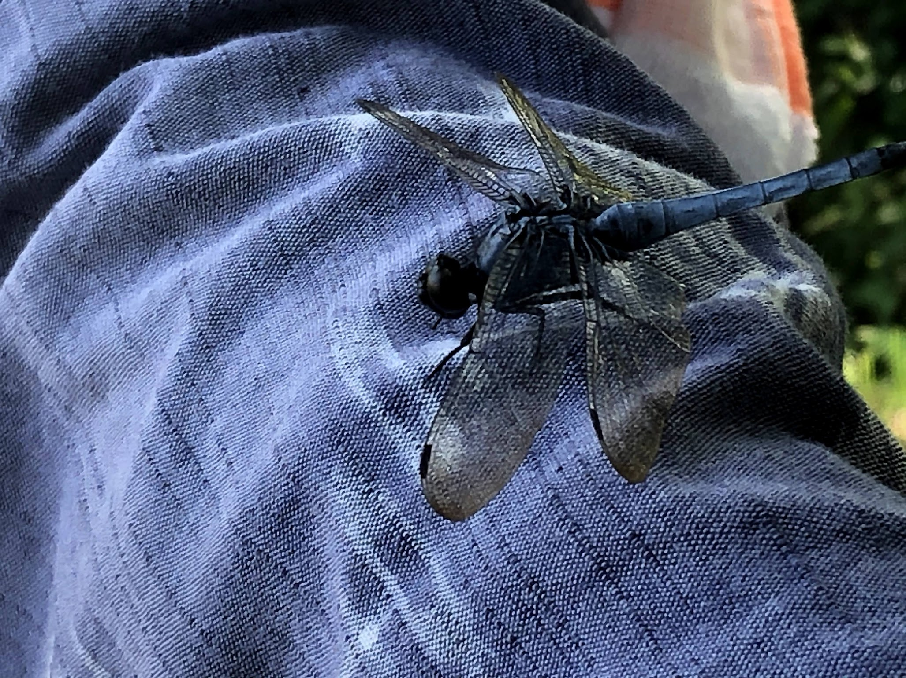

# chatty-journal-20220819

<h2 style="display:inline">本日の活動</h2>

 <h3>早朝学習の課題</h3>
 <ol>
  <li>wsl2のubuntuターミナルの改善課題（１）</li>
  
下図のプロンプト前の芽メッセージがだるいの消したい

  

  
メッセージの最後の部分にントを出しているので素直にやってみる
   ヒントとなる文言：This massage is shown once a day. To disable it please create the /home/nob/.hushlogin file.

   このヒントのとおりやってみる：$ touch ~/.hushlogin
   ※また表示させたいときは作ったファイルを削除すれば良いと思う

  
  <li>wsl2のubuntuターミナルの改善課題（２）</li>
  
ターミナルの初期ディレクトリがubuntuのホームディレクトリに設定したい
    ※現状ではwindowsのホームディレクトリになっている

 </ol>

<h2 style="display:inline">アコーディオンひな形</h2>

 <h3>タイトル</h3>
 <ol>
  <li>番号付きリスト</li>
  <li></li>
 </ol>
 <ul>
  <li>記号付きリスト</li>
  <li></li>
 </ul>
 
画像の利用

 

